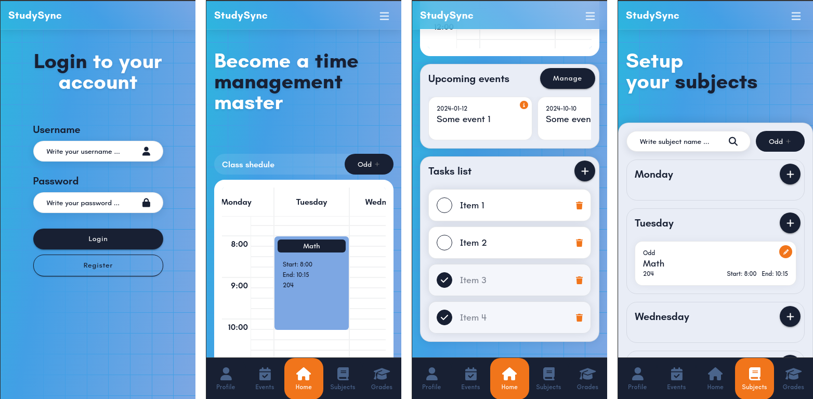
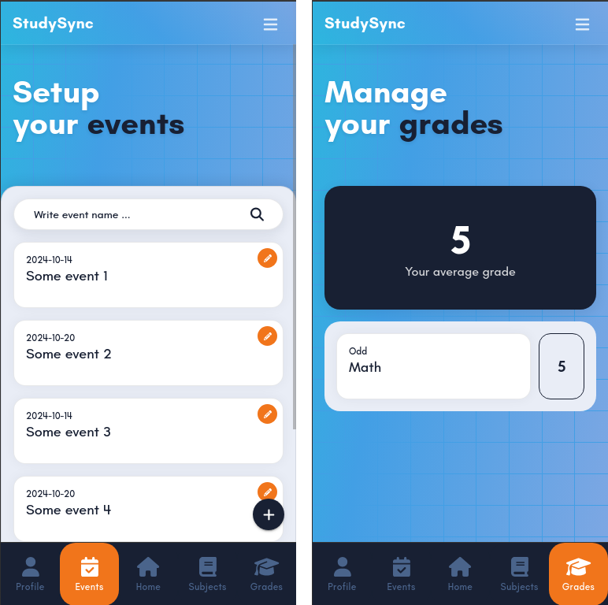

# Study Sync Client

1. [About](#about)
2. [Tech stack](#tech-stack)
3. [Project setup](#project-setup)
4. [Project management](#project-management)

## About

Client project, mobile application for Study Sync




## Tech stack

- TypeScript
- Vue 3
- Ionic
- Vitest
- Cypress
- Webpack
- Husky
- CommitLint
- Pinia
- Capacitor

## Project setup

### [1] Clone repository

```sh
git clone git@github.com:mikolajszymczuk1/StudySync.git
```

### [2] Install all dependencies

```sh
npm ci
```

### [3] Install ionic

```sh
npm install -g @ionic/cli
```

### [4] Install android studio / Xcode

### [5] Setup android studio / Xcode + ionic + capacitor to work together correctly

## Project management

### Development

```sh
ionic serve --port 5137
```

### Run unit and endpoints tests

```sh
npm run test:unit
```

### Build project

```sh
npm run build
npx cap sync
```

Next in android studio or Xcode compile project and build output files

### Lint project

```sh
npm run lint
```
